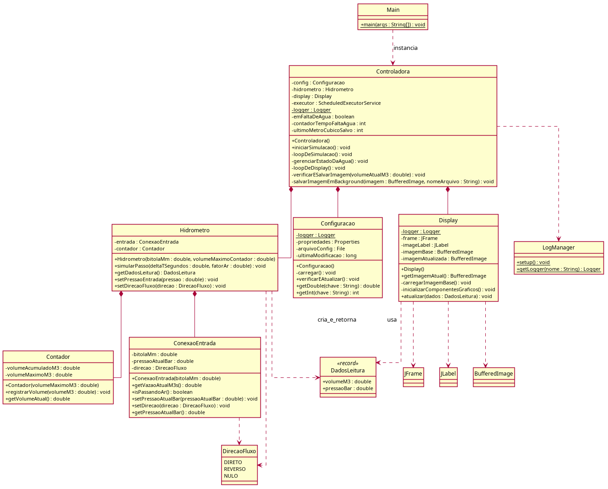

# 💧 Simulador de Hidrômetro Analógico

[](https://www.oracle.com/java/)

Simulador orientado a objetos de um hidrômetro analógico, desenvolvido em **Java**, que modela de forma simplificada o funcionamento físico-digital de um hidrômetro real.
O sistema é configurável, possui interface gráfica, gera logs e snapshots, além de suportar **hot-reload de configuração**.

---

## 🚀 Funcionalidades

- ✅ **Simulação baseada em tempo (Δt)** – evolução em passos discretos.
- ✅ **Modelagem do fluxo de água** – cálculo da vazão considerando pressão e bitola.
- ✅ **Contador cumulativo com rollover** – registra volume total em m³.
- ✅ **Passagem de ar** – simula leituras incorretas após falta de água.
- ✅ **Eventos de falta d’água** – interrupções aleatórias com retorno gradual.
- ✅ **Fluxo reverso** – ignorado na contagem, conforme hidrômetros reais.
- ✅ **Interface gráfica (UI)** – mostragem visual dinâmica sobre imagem do hidrômetro.
- ✅ **Configuração externa (config.txt)** – com recarregamento automático (**hot-reload**).
- ✅ **Logs automáticos** – registro de pressão e volume em arquivo de log.
- ✅ **Snapshots automáticos** – imagens JPEG salvas a cada m³ medido.

---

## 🛠️ Arquitetura

O projeto segue o padrão **MVC (Model-View-Controller)** adaptado:

- **Model** → `Hidrometro`, `Contador`, `ConexaoEntrada`, `DadosLeitura`, `DirecaoFluxo`
- **View** → `Display`
- **Controller** → `Controladora`
- **Util** → `Configuracao`, `LogManager`

---

### 📌 Diagrama de Classes UML
Diagrama de Classes UML desenvolvido utilizando a ferramenta PlantUML
!
*(O diagrama completo também está disponível em [PDF](docs/diagrama.pdf))*

---

## 📂 Estrutura de Arquivos do Projeto
```text
SimuladorHidrometro/
├── src/
│ ├── Main.java
│ ├── Controladora.java
│ ├── Hidrometro.java
│ ├── Contador.java
│ ├── ConexaoEntrada.java
│ ├── Configuracao.java
│ ├── Display.java
│ ├── LogManager.java
│ ├── DadosLeitura.java
│ └── DirecaoFluxo.java
├── config.txt                 # Arquivo de configuração externa
├── simulador.log              # Arquivo de log (gerado em runtime)
├── Medicoes_/                 # Pasta com snapshots em JPEG
├── docs/                      # Diagramas UML e documentação
└── README.md
```

---

## ⚙️ Configuração

O comportamento do simulador é definido no arquivo `config.txt`.
Exemplo de parâmetros disponíveis:

| Parâmetro                  | Tipo   | Descrição                      | Valor padrão |
|----------------------------|--------|----------------------------------|--------------|
| `bitola_mm`                | double | Diâmetro da tubulação (mm)       | 20.0         |
| `max_volume_m3`            | double | Volume máximo antes de rollover  | 99999.999    |
| `pressao_base_bar`         | double | Pressão normal da rede (bar)     | 2.5          |
| `delta_t_simulacao_ms`     | int    | Intervalo do tick de simulação   | 100          |
| `intervalo_update_display` | int    | Frequência de atualização da UI  | 500          |
| `chance_falta_agua`        | double | Probabilidade de falta d’água    | 0.01         |
| `duracao_falta_total_ms`   | int    | Duração da fase sem água (ms)    | 5000         |
| `duracao_passagem_ar_ms`   | int    | Duração da fase com ar (ms)      | 3000         |
| `fator_ar`                 | double | Multiplicador de vazão de ar     | 0.1          |

---

## ▶️ Como Executar

A seguir estão os passos para clonar, compilar e executar o projeto em seu ambiente local.

### 📋 Pré-requisitos

- Java JDK 11 ou superior instalado e configurado no PATH do sistema.

---

**1. Clone o repositório**

O comando abaixo irá clonar o repositório para sua máquina local e, em seguida, entrar na pasta do projeto.

```bash
git clone [https://github.com/PedroHenriqueRolimCordeiro/SimuladorHidrometro.git](https://github.com/PedroHenriqueRolimCordeiro/SimuladorHidrometro.git)
cd SimuladorHidrometro
```
**2. Compile o projeto**

Este comando irá compilar todos os arquivos `.java` da pasta `src` e colocar os arquivos `.class` compilados na pasta `bin`.
```bash
javac -d bin src/*.java
```

**3. Execute o simulador**

Finalmente, este comando executa a classe `Main` a partir da pasta `bin`, iniciando a simulação.
```bash
java -cp bin Main
```
